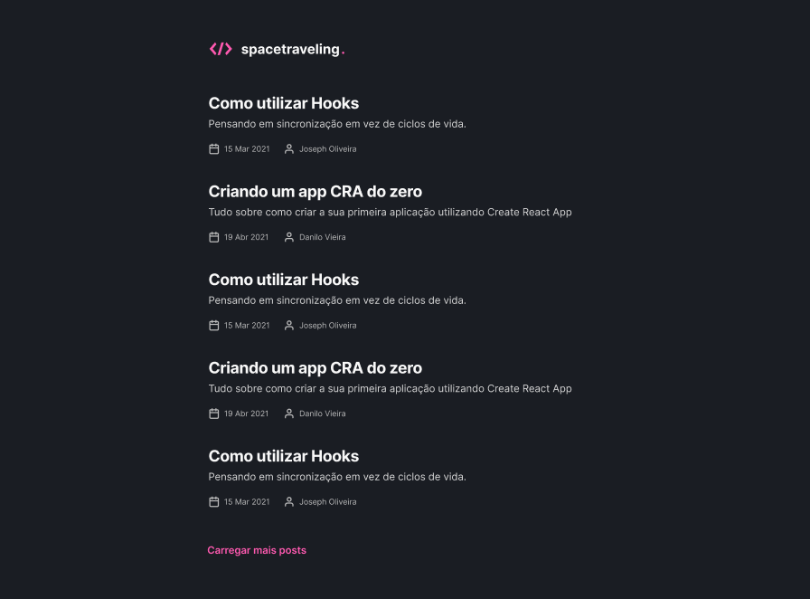
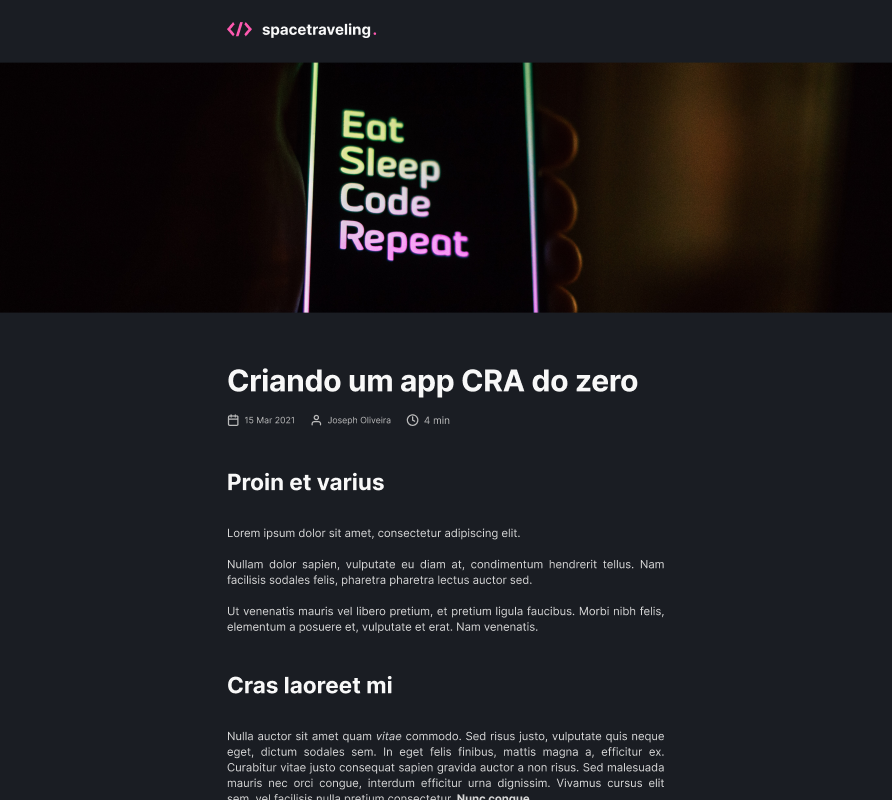

  
  
Blog desenvolvido com Next.js, SCSS e Prismic CMS.

<figure>

<figcaption align="center"><b>Preview 1 - Página inicial</b></figcaption>
</figure>

 
 

<figure>

<figcaption align="center"><b>Preview 2 - Página da publicação</b></figcaption>
</figure>

---

Feito com ❤️ por Gabriel Ramos  

